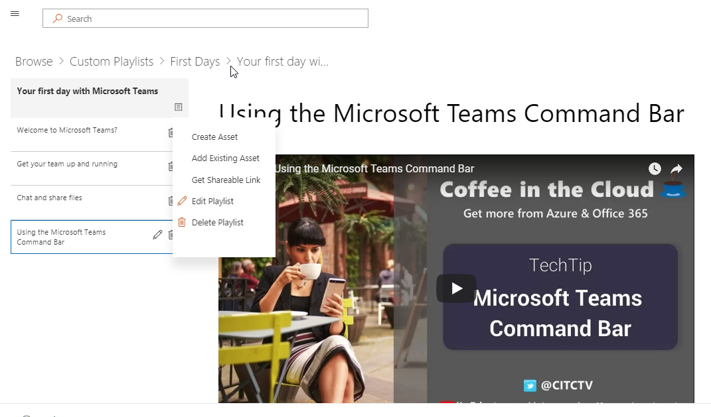

# Personalizzato di formazione per Office 365Custom Learning for Office 365

## Self-service, soluzioni personalizzabili formazione MicrosoftSelf service, customizable training solutions from Microsoft

Personalizzata di formazione per Office 365 è un insieme di formazione e adozione strumenti open source progettata per aumentare l'utilizzo di Office 365 all'interno dell'organizzazione. Creato in relazione con il team di esperienza e assistenza moderno e gruppi Teams Microsoft e progettazione di prodotti SharePoint, queste soluzioni di semplice utilizzo possono essere installate e personalizzate nel tenant di SharePoint Online.Custom Learning for Office 365 is a set of training and adoption open source tools designed to increase usage of Office 365 in your organization. Created in partnership with Microsoft Teams and SharePoint Product Engineering groups and the Modern Assistance and Experience team, these simple-to-use solutions can be installed and customized in your SharePoint Online tenant. 

Queste soluzioni portare agli utenti finali tutto il contenuto di formazione che Microsoft può offrire e mantenere tale contenuto aggiornati su richiesta.  Il sito può essere integrato con facilità con l'installazione di Microsoft Teams o altri siti di SharePoint Online esistenti nell'azienda.These solutions bring to your end-users all the training content that Microsoft has to offer and keeps that content up to date on demand.  The site can easily be integrated with your installation of Microsoft Teams or other existing SharePoint Online sites in your company.

I contenuti di formazione personalizzati attualmente nell'ambito per l'inizio del contenuto per i prodotti di Office 365.  Se si desidera visualizzare più contenuto incluso, invio di commenti [e suggerimenti](feedback.md) nel nostro forum in linea.Our custom learning content is currently scoped to beginning content for Office 365 products.  If you'd like to see more content included, give us [suggestions and feedback](feedback.md) in our online forum.  

## Apprendimento personalizzato Open Source componentiCustom Learning Open Source Components

Personalizzato di formazione per Office 365 sono disponibili due opzioni:Custom Learning for Office 365 provides two options: 

**Opzione 1**: [personalizzato apprendimento di SharePoint Online Site Package](installsitepackage.md)**Option 1**: [The Custom Learning SharePoint Online Site Package](installsitepackage.md)

Selezionare, installare e configurare il pacchetto di siti SharePoint Online di comunicazione per creare un portale dedicato alla formazione per la propria azienda. In precedenza noto come Toolkit per il lavoro del team, è possibile personalizzare questo portale dedicato alla formazione per aggiungere il contenuto della Guida in linea, supporto e community dell'organizzazione. È inoltre possibile rimuovere qualsiasi contenuto relativo a servizi non è supportati per l'organizzazione. Personalizzato apprendimento pacchetto del sito include anche informazioni personalizzate web part che fornisce un aggiornate feed dei contenuti di formazione di Office 365 nell'organizzazione.Select, install, and configure this SharePoint Online communication site package to create a training portal for your company. Formerly known as Toolkit for Teamwork, this training portal can be customized to add your organization's help, support, and community content. You can also remove any content related to services not supported within your organization. The custom learning site package also includes the Custom Learning web part that provides an up-to-date feed of Office 365 training content to your organization. 

**Opzione 2**: opzione di apprendimento personalizzato The [L'apprendimento personalizzato per Office 365 web part](installwebpart.md) web part è progettato per le organizzazioni che desiderano integrare formazione di Office 365 in un sito di comunicazione di SharePoint Online esistente. Web part di apprendimento personalizzato può essere installata in qualsiasi pagina di SharePoint Online e fornisce un feed aggiornato della suite completa del contenuto per la formazione di Office 365 dal Support.Office.com sito Microsoft. Formazione contenuto pubblicato tramite la web part è organizzata per utilizzare gli elenchi di riproduzione. Gli amministratori possono inoltre utilizzare la web part per creare elenchi di riproduzione formazione personalizzata, la combinazione di contenuto da YouTube, contenuto ospitato in locale, ad esempio. File PDF e contenuto per la formazione di Office 365, per fornire formazione esperienze personalizzati alle specifiche esigenze dell'organizzazione.**Option 2**: [The Custom Learning for Office 365 web part ](installwebpart.md) The Custom Learning web part option is designed for organizations that want to integrate Office 365 training into an existing SharePoint Online communication site. The Custom Learning web part can be installed on any SharePoint Online page and provides an up-to-date feed of the full suite of Office 365 training content from Microsoft's Support.Office.com site. Training content delivered through the web part is organized in easy-to-consume playlists. Administrators can also use the web part to build custom training playlists, combining content from YouTube, locally hosted content like .PDFs, and Office 365 training content, to provide training experiences tailored to the unique needs of the organization.

## 3 semplici passaggi3 Easy Steps

Consente di [iniziare a](prereqs.md) creare un soluzioni formazione semplice con Microsoft aggiornati contenuto.Lets [get started](prereqs.md) creating a simple training solutions with up to date Microsoft content.

1. Selezionare il diritto di soluzioneSelect the solution right for you
2. Personalizzare & l'installazione completa del contenutoComplete your installation & customize your content
3. Condividere il sito con gli utenti utilizzando gli [Strumenti di adozione](driveadoption.md)Share your site with your users using our [adoption tools](driveadoption.md)
