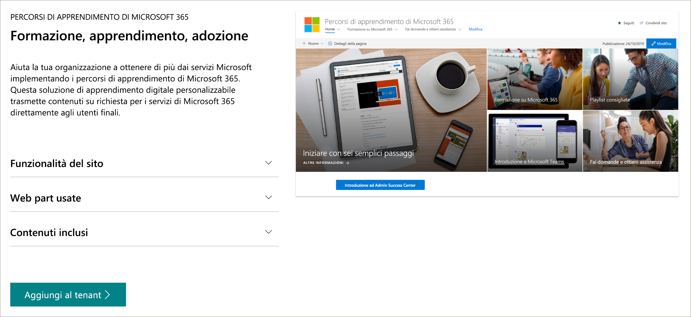

# Percorsi di apprendimento di Microsoft 365Microsoft 365 learning pathways 
Microsoft 365 Learning pathways è una soluzione di apprendimento su richiesta personalizzabile, progettata per aumentare l'utilizzo e l'adozione dei servizi di Microsoft 365 nell'organizzazione.Microsoft 365 learning pathways is a customizable, on-demand learning solution designed to increase usage and adoption of Microsoft 365 services in your organization.    

> [!IMPORTANT]
> I percorsi di apprendimento si sforzano di aderire a un ciclo di aggiornamento trimestrale del contenuto.Learning pathways strives to adhere to a quarterly content update cycle. A 9/24/2020, è stato aggiornato il contenuto dei percorsi di apprendimento per l'aggiornamento del contenuto di settembre.As of 9/24/2020, we've updated the learning pathways content for our September content update. Per ulteriori informazioni sull'aggiornamento del contenuto di settembre 2020, vedere [aggiornamenti del contenuto](custom_contentupdates.md).To learn more about the September 2020 content update, see [Content Updates](custom_contentupdates.md). Per informazioni su come vengono applicati gli aggiornamenti del contenuto e su come gestirne il contenuto, vedere [Manage content updates](custom_contentupdatesmanage.md).To learn about how content updates are applied and how to manage content them, see [Manage Content Updates](custom_contentupdatesmanage.md).  

## Formazione su richiesta e personalizzata da MicrosoftOn-demand, custom training from Microsoft

Microsoft 365 Learning pathways offre:Microsoft 365 learning pathways offers:

- **Un sito di comunicazione SharePoint Online completamente personalizzabile** -il portale di formazione dei percorsi di apprendimento può essere personalizzato per aggiungere il contenuto della guida, del supporto e della community dell'organizzazione.**A fully customizable SharePoint Online communication site** - The learning pathways training portal can be customized to add your organization's help, support, and community content
- **Facile provisioning** -provisioning dei percorsi di apprendimento dal servizio di provisioning di SharePoint Online con pochi semplici passaggi**Easy provisioning** - Provision learning pathways from the SharePoint Online Provisioning Service with just a few easy steps
- **La possibilità di creare playlist di formazione personalizzate** -con percorsi di apprendimento, è possibile creare playlist di formazione mirate per soddisfare le esigenze specifiche dell'ambiente**The ability to create your own training playlists** - with learning pathways, you can create targeted training playlists to meet the unique needs of your environment
- Le vie di apprendimento del **contenuto aggiornate** forniscono contenuto tramite un catalogo di contenuto Microsoft online, in modo che il contenuto del sito venga aggiornato regolarmente**Up-to-date content** - Learning pathways provides content through a Microsoft online content catalog, so the content at your site is regularly updated

> [!VIDEO https://www.microsoft.com/videoplayer/embed/RE42hMy]

## Servizio di ricerca di SharePointSharePoint look book service
È possibile eseguire il provisioning dei percorsi di apprendimento dal servizio di ricerca di SharePoint.Learning pathways can be provisioned from the SharePoint look book service. Quando si esegue il provisioning dei percorsi di apprendimento di Microsoft 365, le organizzazioni ottengono un sito di comunicazione di SharePoint Online creato per essere un portale di formazione esterno, insieme a una Web part per i percorsi di apprendimento connesso a un catalogo online di contenuti di formazione.When Microsoft 365 learning pathways is provisioned, organizations get a SharePoint Online communication site designed to be an out-of-the box training portal, along with a learning pathways Web part connected to an online catalog of training content. 

## 4 semplici passaggi4 Easy Steps
Iniziamo a creare un'esperienza di apprendimento dei percorsi per l'ambiente.Let's get started creating a learning pathways experience for your environment.
1. Leggere la [Panoramica del supporto multilingue per i percorsi di apprendimento](custom_overview_ml.md).Read the [Overview of multilingual support for learning pathways](custom_overview_ml.md). 
2. Scegliere un' [opzione di installazione](custom_setupoptions.md) e provisioning di Microsoft 365 Learning pathways.Choose a [setup option](custom_setupoptions.md) and provision Microsoft 365 learning pathways.  
3. Percorsi di apprendimento personalizzati per l'ambiente.Tailor learning pathways for your environment.
4. Condividere i percorsi di apprendimento con gli utenti utilizzando gli [strumenti di adozioni](driveadoption.md).Share learning pathways with your users using our [adoption tools](driveadoption.md).

## Feedback e supportoFeedback and Support

Microsoft 365 Learning pathways è un progetto open source supportato dall' [elenco dei problemi online](https://aka.ms/CustomLearningHelp) su GitHub.Microsoft 365 learning pathways is an open source project supported through our [online issues list](https://aka.ms/CustomLearningHelp) on GitHub. La soluzione percorsi di apprendimento e i suoi componenti non sono coperti da alcun contratto di supporto tecnico Microsoft esistente.The learning pathways solution and it's components are not covered by any existing Microsoft support contract.  

## Risorse aggiuntiveAdditional Resources
È possibile utilizzare il sito Microsoft 365 Learning pathways per fornire collegamenti a qualsiasi nuovo o esistente forum della community di utenti.You can use the Microsoft 365 learning pathways site to provide links to any new or existing user community forums. È consigliabile avviare un gruppo di utenti interno, se non è già presente, per consentire agli utenti di condividere i propri successi e imparare gli uni dagli altri.Consider starting an internal user group, if you don't have one already, to enable people to share their success and learn from each other.  Se non si ha tempo per alimentare un gruppo di utenti interno, è possibile che i dipendenti possano partecipare alla [community di campioni di Microsoft Office 365](https://aka.ms/O365Champions) per la formazione mensile, l'appartenenza alla comunità online e l'accesso anticipato agli strumenti e alle risorse per Office 365.If you don't have time to nurture an internal user group, you and your employees can join the [Microsoft Office 365 Champion community](https://aka.ms/O365Champions) for monthly training, membership in the online community, and early access to tools and resources for Office 365.