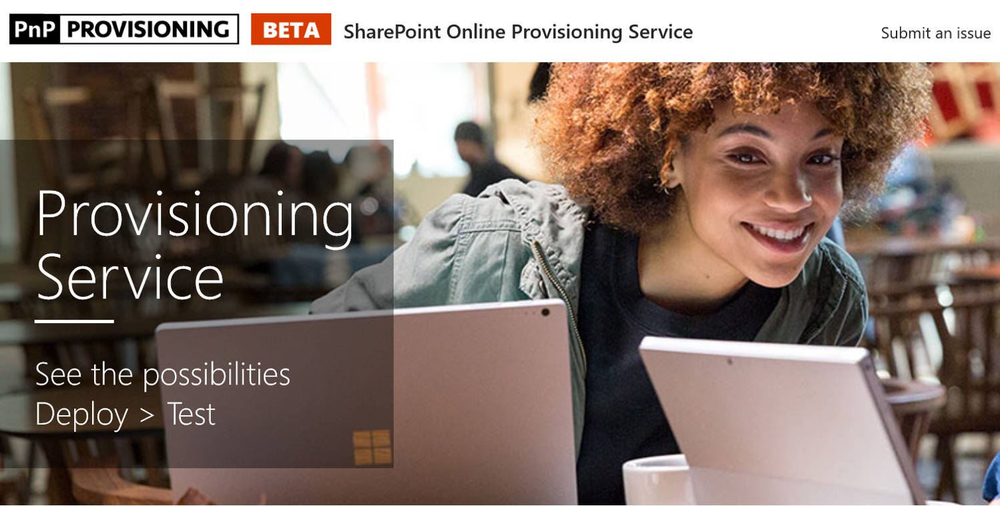

# Eseguire il provisioning personalizzato del sito di apprendimento

1. Accedere a http://provisioning.sharepointpnp.com e accedere utilizzando le credenziali per un tenant di destinazione si prevede di utilizzare per l'installazione. 
1. Spuntare consenso dell'utente per l'organizzazione e selezionare accetta.
1. Selezionare personalizzato formazione per Office 365 dalla raccolta soluzioni. 
1. Selezionare Aggiungi per Tenant 
1. Modificare le selezioni predefinite nella pagina provisioning come necessario e seleziona il provisioning quando si è pronti a installare CLO365 tenant l'ambiente in uso.  
1. Il processo di provisioning avrà un massimo di 15 minuti. Si riceverà una notifica tramite posta elettronica (per l'indirizzo di posta elettronica immesso nella pagina Provisioning) quando è pronto per l'accesso al sito. 
1. Una volta eseguito l'accesso a CLO365 nel tenant, preferito del sito e copiare l'url per riferimento futuro.  

## Passaggi successivi
- Esplorare il [contenuto predefinito](sitecontent.md) incluso nella Web part.
- [Personalizzare](customization.md) l'esperienza di formazione per l'organizzazione.
- [Unità adozione](driveadoption.md) della soluzione di formazione.

