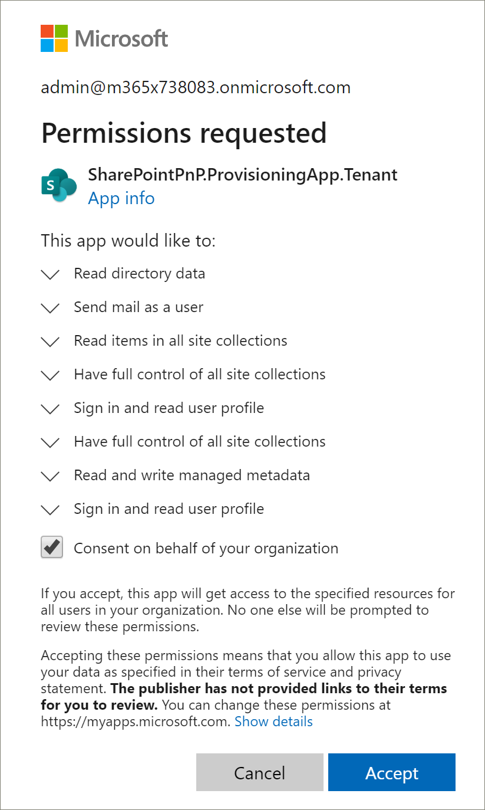

# ProVisioning del sito di apprendimento personalizzato

1. Passare a http://provisioning.sharepointpnp.com e **accedere** dall'angolo in alto a destra della Home page.  Accedere con le credenziali del tenant di destinazione in cui si intende installare il modello di sito.

2. Cancellare il **consenso per conto dell'organizzazione** e selezionare **accetta**.

3. Selezionare **apprendimento personalizzato per Office 365** dalla raccolta soluzioni.

4. Nella Home page della soluzione selezionare **Aggiungi al tenant**

5. Completare i campi nella pagina informazioni di provisioning in base alle proprie esigenze per l'installazione. Immettere almeno l'indirizzo di posta elettronica in cui si desidera ottenere le notifiche relative al processo di provisioning e all'URL di destinazione del sito di cui eseguire il provisioning.  

> [!NOTE]
> Rendere l'URL di destinazione per il sito una cosa semplice per i dipendenti, ad esempio "/sites/MyTraining" o "/teams/LearnOffice365".

6. Selezionare **** provisioning quando si è pronti per installare CLO365 nell'ambiente tenant.  Il processo di provisioning richiederà fino a 15 minuti. L'utente riceverà una notifica tramite posta elettronica (all'indirizzo di posta elettronica di notifica immesso nella pagina di provisioning) quando il sito è pronto per l'accesso.

7. Dopo aver ricevuto una notifica del completamento del provisioning, passare all'URL di destinazione immesso nella pagina di provisioning.

8. Favorito il sito nell'angolo in alto a destra e aggiungere un segnalibro all'URL per riferimento futuro.  

### Passaggi successivi
- Esaminare il [contenuto predefinito](sitecontent.md) incluso in WebPart.
- [Personalizzare](customization.md) l'esperienza di formazione per l'organizzazione.
- [Guidare l'adozione](driveadoption.md) della soluzione di formazione.
