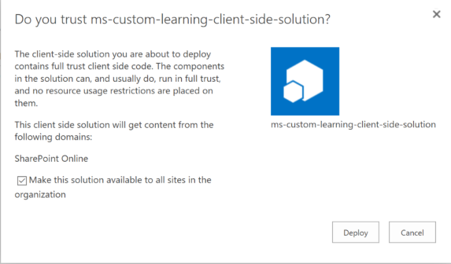
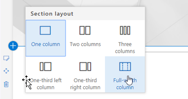
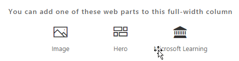

# L'installazione personalizzata soluzione Web part di apprendimento

## Prerequisiti per un'installazione a livello di tenant

- Per installare la Web part apprendimento personalizzato per il tenant intero è necessario disporre delle autorizzazioni di amministrazione di Office 365.  Se non si dispone di queste autorizzazioni, è possibile contattare l'amministratore di Office 365 oppure installare la Web part per una singola raccolta di siti.
- Utente o dall'amministratore di Office 365 deve già stato installato e configurato un livello di tenant [Catalogo applicazioni](https://docs.microsoft.com/en-us/sharepoint/dev/spfx/set-up-your-developer-tenant) o un [Catalogo App raccolta siti](https://docs.microsoft.com/en-us/sharepoint/dev/general-development/site-collection-app-catalog)per la ricezione della Web part.]
- È solo supportano SharePoint Online. La web part non è supportato per l'installazione su qualsiasi versione di SharePoint in locale.

## Aggiungere la Web part apprendimento personalizzato per il tenant 

1. Scaricare la Web part personalizzata apprendimento e salvarlo nell'unità disco locale.  In questo file è denominato "ms-personalizzato-learning.sppkg".  Non modificare il nome o il suffisso del file. 
2. Passare al [portale di amministrazione di Office 365](https://admin.microsoft.com/AdminPortal/Home#/homepage) per il tenant
3. Riquadro di spostamento sinistro selezionare interfacce di amministrazione, di SharePoint. Verrà aperta in una nuova scheda, nell'interfaccia di amministrazione SharePoint Apps select, catalogo App, App per SharePoint 
4. Selezionare caricare la Web part e selezionare il file "ms-personalizzato-learning.sppkg" è stato scaricato
5. Per l'installazione a livello di tenant selezionare la casella accanto a "Creazione della soluzione disponibile per tutti i risiede all'interno dell'organizzazione".  

## Aggiungere la Web part formazione dei clienti per una pagina di SharePoint Online

Dopo l'installazione di apprendimento personalizzato nel tenant è possibile aggiungere la Web part a una pagina di SharePoint. In questo caso, improvvisamente formazione di Office 365 è disponibile. 

1. Aggiungere la Web part apprendimento personalizzato in un layout di colonna larghezza intera:

2. Nella pagina di SharePoint, selezionare Aggiungi sezione e quindi selezionare larghezza intera colonna.  Verrà visualizzato il prompt dei comandi seguenti:

3. Selezionare Microsoft Learning.  Viene visualizzato il seguente: 

 È possibile ora fare clic su sezioni per esplorare il contenuto predefinito incluso nella soluzione.  

## Passaggi successivi
- Esplorare il [contenuto predefinito](webpartcontent.md) incluso nella Web part.
- [Personalizzare](customization.md) l'esperienza di formazione per l'organizzazione.
- [Unità adozione](driveadoption.md) della soluzione di formazione.

