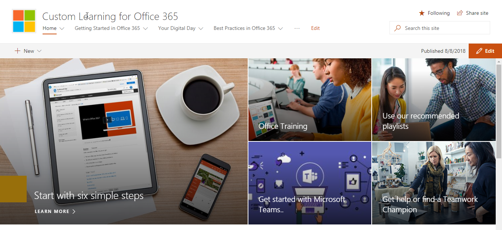

# Esplorare il sito e il contenuto predefinito

### Visitare il sito 

Passare alla Home page e selezionare Office 365 training. Ogni pagina del sito di SharePoint Online è configurata per ospitare Microsoft Learning WebPart. In questo modo la pagina consente di visualizzare tutto il contenuto disponibile all'interno del controllo WebPart.

Dalla barra dei menu, selezionare l'elemento di spostamento **Office 365 Training** e quindi **fare clic su inizia con OneDrive**. In questo caso, la Web part filtra il contenuto in modo da visualizzare solo il contenuto di OneDrive.

Ripetere questi passaggi per le altre due opzioni di menu, iniziare a utilizzare i **Team** e iniziare a **utilizzare SharePoint Online** per esaminare il contenuto e verificare la struttura di spostamento.

Tornare alla Home page e selezionare **inizia con sei semplici passaggi**. Questo porta alla scaletta sei passaggi semplici.

> [!TIP]
> I sei semplici passaggi sono derivati da un team di ricerca di Microsoft. Questi sono i passaggi che i ricercatori Microsoft hanno trovato più appiccicoso, il che significa che se gli utenti passano questa procedura, l'utilizzo di Office 365 aumenterà e diventeranno lavoratori più produttivi. E questo è un bene per tutti.

### Andare a iniziare con sei semplici passaggi
- Nella Home page fare clic su Avvia con sei semplici passaggi. 
- La pagina Training di Office viene visualizzata con la Web part apprendimento personalizzato instradata all'inizio con sei semplici passaggi.  

### Visualizzazione di un elenco di elenchi di riproduzione per una categoria

Nella pagina Office 365 training selezionare Excel training per accedere a un elenco di playlist di formazione Excel.

### Visualizzazione di una playlist

Fare clic su **benvenuto in Excel** per visualizzare la playlist

Il sito è ora configurato con il contenuto corretto visualizzato in ogni pagina. 

## Passaggi successivi
- [Personalizzare il contenuto del sito](customization.md)
- [Adozione di unità](driveadoption.md) 
