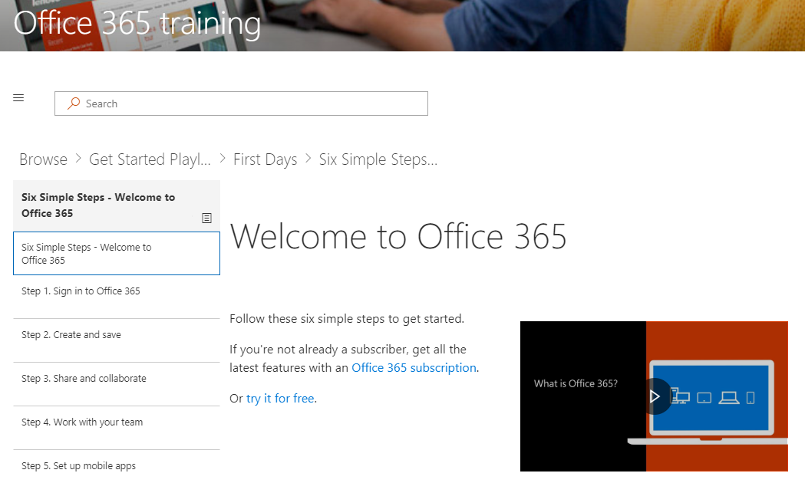

# Esplorare il sito e il contenuto predefinitoExplore the site and default content

### Visitare il sitoTour the site 

Passare alla Home page e selezionare Office 365 training. Ogni pagina del sito di SharePoint Online è configurata per ospitare Microsoft Learning WebPart. In questo modo la pagina consente di visualizzare tutto il contenuto disponibile all'interno del controllo WebPart.Navigate to the Home page and select Office 365 Training. EAch page in the SharePoint Online site is configured to host the Microsoft Learning webpart. This enables the page to  display all the content available within the webpart.

Dalla barra dei menu, selezionare l'elemento di spostamento **Office 365 Training** e quindi **fare clic su inizia con OneDrive**. In questo caso, la Web part filtra il contenuto in modo da visualizzare solo il contenuto di OneDrive.From the menu bar, select the navigation item **Office 365 Training** and then select **Get Started with OneDrive**. In this case, the Web part filters the content to show only OneDrive content.

Ripetere questi passaggi per le altre due opzioni di menu, iniziare a utilizzare i **Team** e iniziare a **utilizzare SharePoint Online** per esaminare il contenuto e verificare la struttura di spostamento.Repeat these steps for the other two menu options, **Get Started with Teams** and **Get Started with SharePoint Online** to review their content and test the navigation.

Tornare alla Home page e selezionare **inizia con sei semplici passaggi**. Questo porta alla scaletta sei passaggi semplici.Navigate back to the Home page and select **Start with Six Simple Steps**. This takes you to the Six Simple Steps playlist.

> [!TIP]
> I sei semplici passaggi sono derivati da un team di ricerca di Microsoft. Questi sono i passaggi che i ricercatori Microsoft hanno trovato più appiccicoso, il che significa che se gli utenti passano questa procedura, l'utilizzo di Office 365 aumenterà e diventeranno lavoratori più produttivi. E questo è un bene per tutti.The Six Simple Steps are derived from a Microsoft research team. These are the steps that Microsoft researchers have found to be the most sticky, meaning if users go through these steps, their use of Office 365 will increase and they will become more productive workers. And that’s good for everybody.

### Andare a iniziare con sei semplici passaggiGo to Start with Six Simple Steps
- Nella Home page fare clic su Avvia con sei semplici passaggi.From the Home page, click Start with six simple steps. 
- La pagina Training di Office viene visualizzata con la Web part apprendimento personalizzato instradata all'inizio con sei semplici passaggi.You see the Office Training page with the Custom Learning web part routed to the Start with six simple steps playlist.  

### Visualizzazione di un elenco di elenchi di riproduzione per una categoriaView a list of playlists for a category

Nella pagina Office 365 training selezionare Excel training per accedere a un elenco di playlist di formazione Excel.From the Office 365 training page select Excel Training to go to a list of Excel Training playlists.

### Visualizzazione di una playlistView a Playlist

Fare clic su **benvenuto in Excel** per visualizzare la playlistClick **Welcome to Excel** to view the playlist

Il sito è ora configurato con il contenuto corretto visualizzato in ogni pagina.Your site is now set up with the correct content being displayed on each page. 

## Passaggi successiviNext Steps
- [Personalizzare il contenuto del sitoCustomize site content](customization.md)
- [Adozione di unitàDrive adoption](driveadoption.md) 
