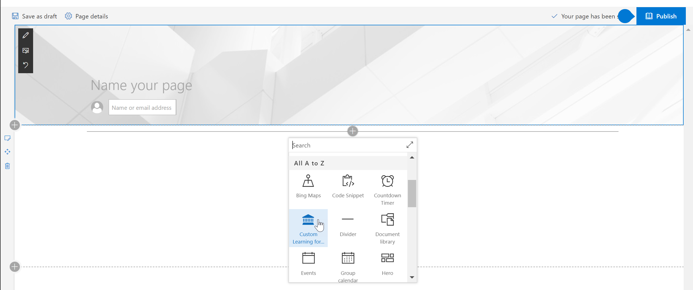
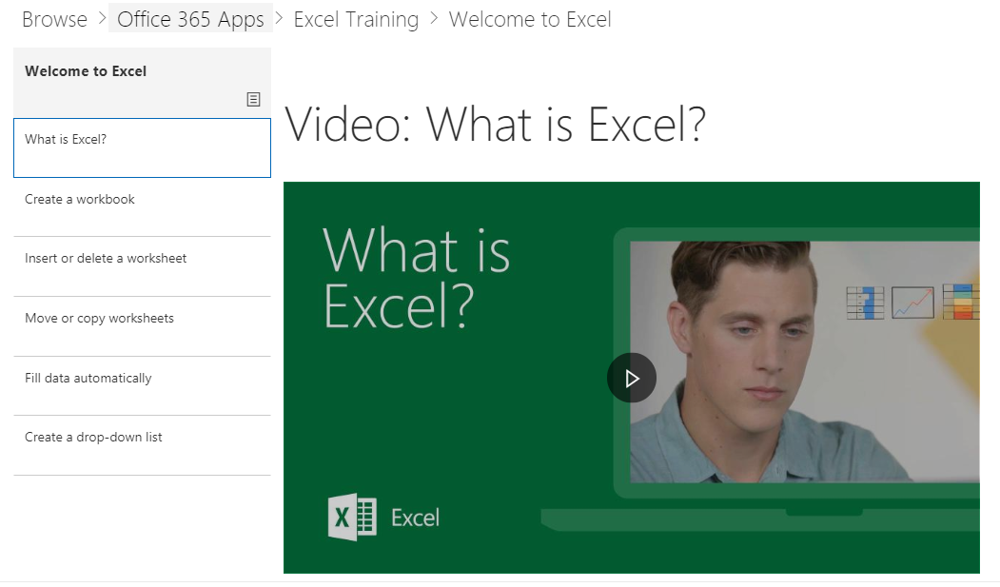

# Contenuto predefinito di Web partWebpart Default Content

## Il modello di elenco di riproduzioneThe Playlist Model

La Web part utilizza un modello di elenco di riproduzione familiare per organizzare il contenuto.  In questo modello è semplice per gli utenti finali di comprendere e per la personalizzazione se si decide di.  Personalizzazione non è necessaria.  Riduzione dell'esperienza completa viene fornita con formazione efficace contenuto basato su nostri ricerche.Our webpart uses a familiar playlist model to organize the content.  This model is simple for your end users to understand and for you to customize should you choose to.  Customization is not required.  Our out of the box experience provides you with effective training content based on our extensive research.

Questi brani sono progettate per consentire alle organizzazioni di personalizzare l'esperienza di formazione per gli utenti e presentarli di facile utilizzo brani illustrare i comportamenti di nuovi e migliorare la produttività. Il contenuto il server di Support.Office.com e le risorse sono semplice ed efficace, con peppy, accattivanti video.These playlists are designed to help organizations tailor the learning experience for users and present them with easy-to-consume playlists to teach them new, and more productive behaviors. The serve content from Support.Office.com, and the assets are short and sweet, with peppy, engaging videos. 

Ogni riquadro rappresenta un singolo elenco di riproduzione in primo piano o una categoria di contenuto. Fare clic su una tessera di riproduzione o categoria rapidamente passa all'utente nell'area selezionata. Nella figura riportata di seguito vengono illustrati entrambi gli elenchi in primo piano nelle categorie "Ottenere de Sélections introduttiva" e applicazioni di Office 365 come Excel, Microsoft Teams e altri utenti.Each tile represents either an individual featured playlist or a content category. Clicking on any playlist or category tile quickly navigates the user into the selected area. The graphic below shows both featured lists under "Get Started Playlist" and Office 365 App categories like Excel, Microsoft Teams and others. 

Facendo clic sulla categoria di Excel, ad esempio li indirizza a una raccolta degli elenchi di riproduzione.  Possono visualizzare il contenuto nell'ordine o selezionare le informazioni importanti in base alle proprie esigenze di formazione.Clicking the Excel category for instance navigates them to a collection of playlists.  They can watch content in order or select what interests them based on their learning needs. 

Elenco di riproduzione vista selezionataSelected playlist view

## Passaggi successiviNext Steps

- Individuare e acquisire familiarità con il contenuto esistenteBrowse and familiarize yourself with the existing content
- Procedere per [personalizzare gli elenchi di riproduzione](customplaylists.md)Proceed to [customize playlists](customplaylists.md)