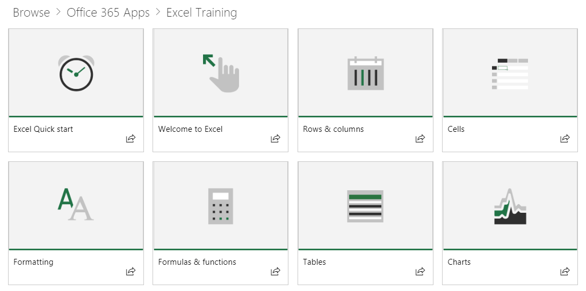

# Contenuto predefinito di Web part

## Il modello di elenco di riproduzione

La Web part utilizza un modello di elenco di riproduzione familiare per organizzare il contenuto.  In questo modello è semplice per gli utenti finali di comprendere e per la personalizzazione se si decide di.  Personalizzazione non è necessaria.  Riduzione dell'esperienza completa viene fornita con formazione efficace contenuto basato su nostri ricerche.

Questi brani sono progettate per consentire alle organizzazioni di personalizzare l'esperienza di formazione per gli utenti e presentarli di facile utilizzo brani illustrare i comportamenti di nuovi e migliorare la produttività. Il contenuto il server di Support.Office.com e le risorse sono semplice ed efficace, con peppy, accattivanti video. 

Ogni riquadro rappresenta un singolo elenco di riproduzione in primo piano o una categoria di contenuto. Fare clic su una tessera di riproduzione o categoria rapidamente passa all'utente nell'area selezionata. Nella figura riportata di seguito vengono illustrati entrambi gli elenchi in primo piano nelle categorie "Ottenere de Sélections introduttiva" e applicazioni di Office 365 come Excel, Microsoft Teams e altri utenti. 

Facendo clic sulla categoria di Excel, ad esempio li indirizza a una raccolta degli elenchi di riproduzione.  Possono visualizzare il contenuto nell'ordine o selezionare le informazioni importanti in base alle proprie esigenze di formazione. 

Elenco di riproduzione vista selezionata

## Passaggi successivi

- Individuare e acquisire familiarità con il contenuto esistente
- Procedere per [personalizzare gli elenchi di riproduzione](customplaylists.md)